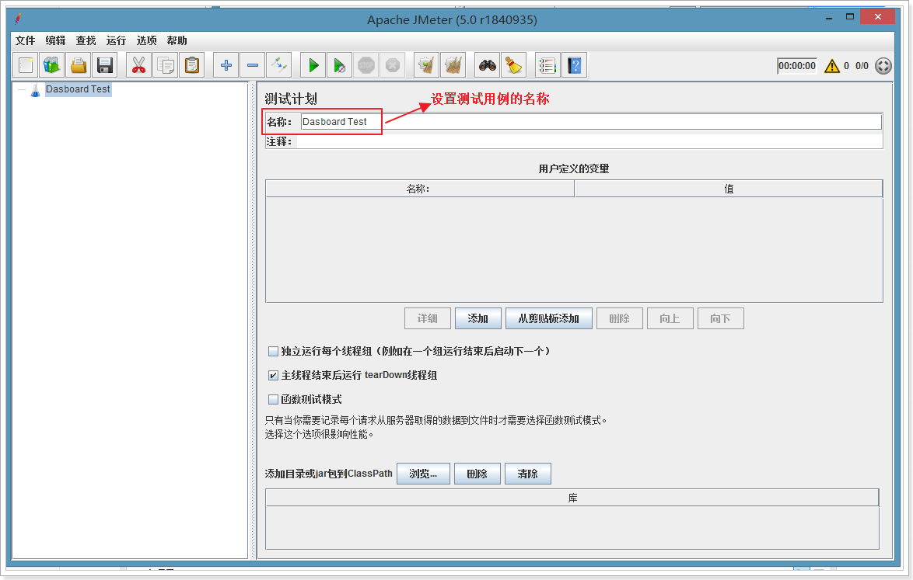
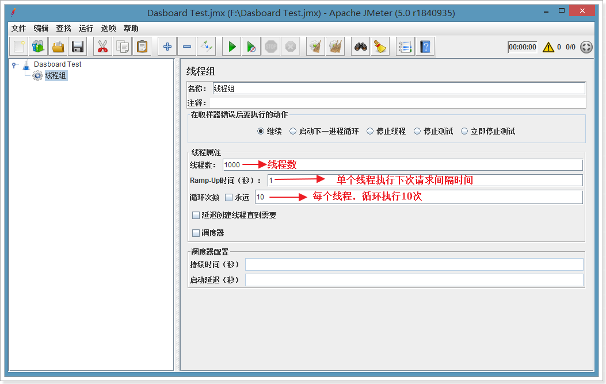
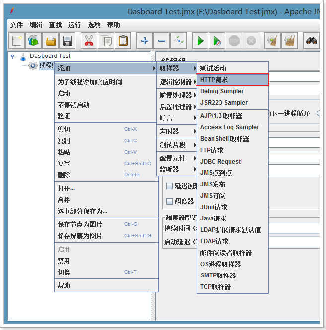
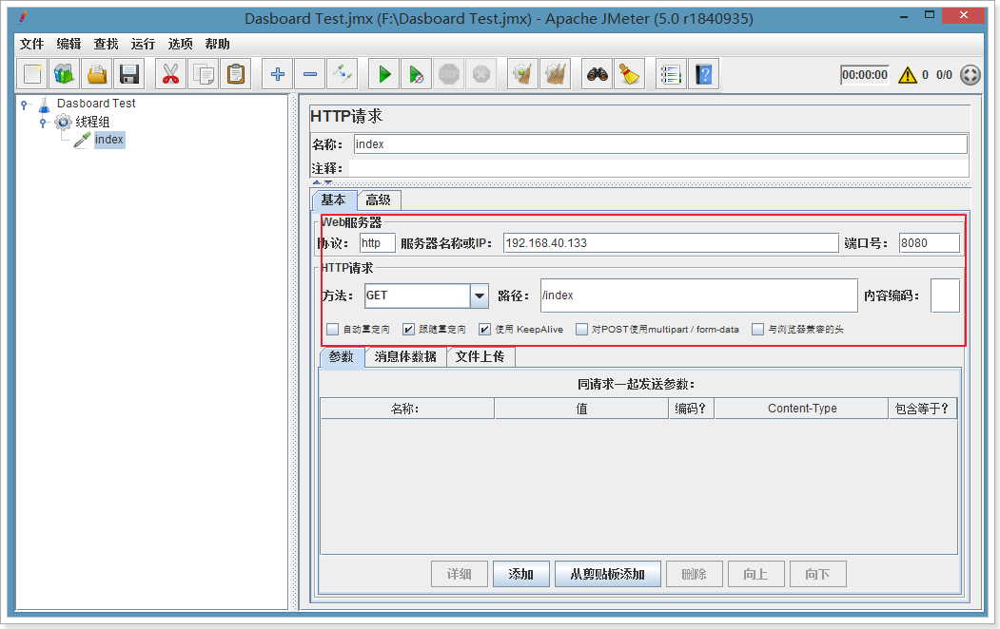
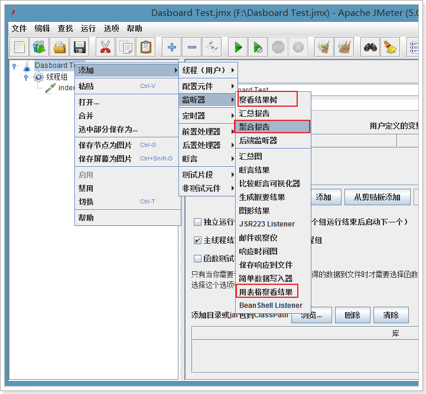
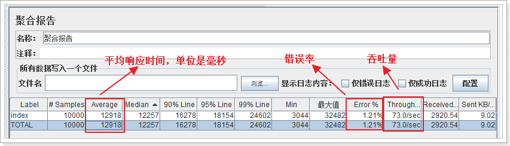

## java后端性能优化方案

后端优化分为代码层面的优化，数据库优化，并发优化，工具类合理选用等等

### 接口性能测试方法
#### 使用`httpd-tools`进行压力模拟测试
+ 安装：yum -y install httpd-tools
+ 使用方法：ab -n 100000(请求数) -c 1000(并发用户数)

### demo示例说明
本次采用的是基于spring boot框架开发的咖啡店预定系统，其中主要使用了以下的技术：
+ MQ消息中间件
+ Redis缓存技术

### 工具类选用及配置
本次项目使用的是spring boot`2.x`版本，其中集成了了当前性能最好的第三方扩展库,
配置文件如application.yml所示。
+ 数据库连接池：hikariCP(spring 2.x默认)
+ Mysql配置优化，充分利用缓存查询，与hikariCP搭配使用性能最好
+ 使用了Mybatis以方便SQL更细粒化的控制

### 代码层面的优化

#### 谨慎使用正则表达式
正则表达式默认是贪婪匹配，比如`\ab${1,3}c\`就是尽可能的匹配多的b，
这样会造成回溯的问题，占用CPU的计算资源。

我们可以使用懒惰匹配`?`以匹配尽可能少的内容，比如`\ab${1,3}?c\`,
表示匹配了一个b之后就不会继续往下匹配。或者采用独占匹配`+`以匹配尽可能多的内容，
比如`\ab${1,3}+bc\`表示如果要匹配`abbc`的话，结果是不匹配的，因为`b${1,3}+`
已经将b匹配完了，后面的c不等于b，匹配不成功。

在分组匹配的时候，我们一般只想取出一部分分组的内容，这时候可以使用`(?:xxx)`
来优化分组匹配计算
```java
class Example{
   public static void main(String[] args){
     String text = "<input>test</input>";
     String reg = "(?:<input.*?>)(.*?)(?:</input>)";
     Pattern p = Pattern.compile(reg);
     Matcher m = p.matcher(text);
     while (m.find()){
         System.out.println(m.group(0)); // 所有匹配到的内容
         System.out.println(m.group(1)); //(.*?) 即 test
     }
   } 
}
```
另外，尽量使用String的indexOf方法替代正则表达式

#### 正确使用List数据结构
常用的List数据结构分为ArrayList和LinkedList，
其中ArrayList基于数组实现的，支持动态扩容和快速随机访问，
而LinkedList则基于双向链表实现。

我们知道基于链表的数据结构，在查找的时候都得先遍历一遍，
但是插入数据的时候一定比ArrayList快吗？
网上有很多资料说得也不准确，在插入数据的时候得具体情况分析：
+ 在尾部插入数据，ArrayList不需要做数据移动，LinkedList需要新建节点对象，总体ArrayList快于LinkedList
+ 在头部插入数据，LinkedList快于ArrayList
+ 在中间插入数据，LinkedList需要遍历，算法复杂度为O(n)，ArrayList也需要移动数组数据，但是ArrayList只需要直接覆盖值操作，LinkedList
  需要创建对象，改变指针等操作，所以在时间上ArrayList快于LinkedList
  
删除操作也是同理

**我们在插入或者删除头元素的时候使用LinkedList，否则其他情况尽可能使用ArrayList**，

```java
class Example{
    public static void main(String[] args){
        List<String> array = new ArrayList<>();
        array.add("1");
        array.add("2");
        array.add("3");
        for(int i = 0; i < array.size(); i++) {
          System.out.println(i);
        }
    }
}
```

#### 字符串操作
字符串拼接操作请务必使用`StringBuilder`，有并发的情况使用`StringBuffer`，
此外在创建字符串的时候禁止使用new创建
```java
public class Example{
    public static void main(String[] args){
      String str = new String("qwe"); // not good
      String str = "qwe"; // good
    }
}
```

#### 借助Stream操作优化遍历，提升性能
首先看一个按照性别过滤身高小于160的学生的例子，传统的做法如下所示：
```java
class Example{
    public static void main(String[] args){
       Map<String, List<Student>> stuMap = new HashMap<>();
              List<Student> studentList = new ArrayList<>();
              studentList.add(new Student(150, "man"));
              studentList.add(new Student(160, "woman"));
              studentList.add(new Student(170, "man"));
              studentList.add(new Student(165, "woman"));
              for (Student student : studentList) {
                  if (student.getHeight() > 160) {
                      if (stuMap.get(student.getSex()) == null) {
                          List<Student> list = new ArrayList<>();
                          list.add(student);
                          stuMap.put(student.getSex(), list);
                      } else {
                          stuMap.get(student.getSex()).add(student);
                      }
                  }
              }
              System.out.println(stuMap); // {man=[Student{height=170, sex='man'}], woman=[Student{height=165, sex='woman'}]}
    }
}
```
如果我们使用Stream的方式处理数据，代码不但变得简单，在处理大量数据的时候，也会提高性能：
```java
public class Example {
    public static void main(String[] args) {
        Map<String, List<Student>> stuMap;
        List<Student> studentList = new ArrayList<>();
        studentList.add(new Student(150, "man"));
        studentList.add(new Student(160, "woman"));
        studentList.add(new Student(170, "man"));
        studentList.add(new Student(165, "woman"));
        // 使用串行方式
        stuMap = studentList.stream().filter(s -> s.getHeight() > 160).collect(Collectors.groupingBy(Student::getSex));
        System.out.println(stuMap); // {man=[Student{height=170, sex='man'}], woman=[Student{height=165, sex='woman'}]}
        // 使用并行方式
        stuMap = studentList.parallelStream().filter(s -> s.getHeight() > 160).collect(Collectors.groupingBy(Student::getSex));
        System.out.println(stuMap); // {man=[Student{height=170, sex='man'}], woman=[Student{height=165, sex='woman'}]}
    }
}
```
再看一个例子
```java
class Example{
    public static void main(String[] args){
      List<String> names = Arrays.asList("张三", "李四", "王老五", "李三", "刘老四", "王小二", "张四", "张五六七");
      // 并行处理
      int res = names.stream().parallel().filter(name -> name.startsWith("张")).mapToInt(String::length).max().orElse(0);
      System.out.println(res); // 4
    }
}
```
总结一下Stream的使用：
+ 在循环迭代次数较少的情况下，常规的迭代方式性能反而更好
+ 在单核 CPU 服务器配置环境中，也是常规迭代方式更有优势
+ 数据量大，如果服务器是多核 CPU 的情况下，Stream 的并行迭代**优势明显**，注意并行计算后终止操作为Collect
+ 并行操作时，需要考虑线程安全的问题

### Tomcat 层面的优化
#### Tomcat性能测试
使用apache jmeter测试工具进行Tomcat性能测试。
jmeter可以模拟用户并发请求，主要测试步骤如下图所示：

1. 保存测试用例 


2. 添加线程组，使用线程模拟用户的并发



1000个线程，每个线程循环10次，也就是tomcat会接收到10000个请求。

3. 添加http请求





4. 添加请求监控



5. 启动、进行测试

6. 聚合报告
在聚合报告中，重点看吞吐量。


测试可以看出，tomcat在不做任何调整时，吞吐量为73次/秒。

#### 配置Tomcat
在调优Tomcat之前，需要配置Tomcat允许本地连接，
在tomcat-users.xml文件中，添加以下内容，增加tomcat的用户访问控制

```html
<role rolename="manager"/>
<role rolename="manager-gui"/>
<role rolename="admin"/>
<role rolename="admin-gui"/>
<user username="tomcat" password="tomcat" roles="admin-gui,admin,manager-gui,manager"/>
```
如果是7以上的版本，并且希望远程主机登录的话，还需要修改`webapps/manager/META-INF/context.xml`
```html
<Context antiResourceLocking="false" privileged="true" >
 <!-- 这段需要注释掉-->
 <!-- <Valve className="org.apache.catalina.valves.RemoteAddrValve"
         allow="127\.\d+\.\d+\.\d+|::1|0:0:0:0:0:0:0:1" /> -->
  <Manager sessionAttributeValueClassNameFilter="java\.lang\.(?:Boolean|Integer|Long|Number|String)|org\.apache\.catalina\.filters\.CsrfPreventionFilter\$LruCache(?:\$1)?|java\.util\.(?:Linked)?HashMap"/>
</Context>
```
通过以上的配置，我们就可以通过tomcat的server status来查看JVM的运行状态，从而进行调优

#### 禁用AJP
一般的大型项目采用的都是 Nginx+Tomcat，我们就不需要AJP了(默认8009端口),节省资源，
在`server.xml`文件中直接禁用掉即可。

```html
<!-- Define an AJP 1.3 Connector on port 8009 -->
<!--    <Connector port="8009" protocol="AJP/1.3" redirectPort="8443" />-->
```
然后重新启动Tomcat服务器

#### 优化Tomcat线程池
Tomcat中为每一个http请求都会创建一个线程，我们可以通过设置线程池来提高性能，
修改`server.xml`文件，打开线程池的注释，并在Connector中指定线程池

```html
    <!--The connectors can use a shared executor, you can define one or more named thread pools-->

    <Executor name="tomcatThreadPool" namePrefix="catalina-exec-"
        maxThreads="500" minSpareThreads="50" prestartminSpareThreads="true" maxQueueSize="100"/>
        
    <!--
    参数说明：
    maxThreads：最大并发数，默认设置 200，一般建议在 500 ~ 1000，根据硬件设施和业务来判断
    minSpareThreads：Tomcat 初始化时创建的线程数
    prestartminSpareThreads： 在 Tomcat 初始化的时候就初始化 minSpareThreads 的参数值，如果不等于 true，minSpareThreads 的值就没啥效果了
    maxQueueSize，最大的等待队列数，超过则拒绝请求，保证服务器的安全，防止雪崩效应，
    并且可以加快平均响应时间，典型12306
    -->
    
    <!--    这里需要指定executor-->
    <Connector executor="tomcatThreadPool"
               port="8080" protocol="HTTP/1.1"
               connectionTimeout="20000"
               redirectPort="8443" />
```
*需要注意的是，在tomcat status中，max-threads的值显示的是-1，这个是表示配置已经生效的意思*

#### Tomcat运行模式
tomcat的运行模式有3种：
1. bio
   默认的模式,性能非常低下,没有经过任何优化处理和支持.
2. nio
   nio(new I/O)，是Java SE 1.4及后续版本提供的一种新的I/O操作方式(即java.nio包及其子包)。
   Java nio是一个基于缓冲区、并能提供非阻塞I/O操作的Java API，因此nio也被看成是non-blocking I/O的缩写。它拥有比传统I/O操作(bio)更好的并发运行性能。
3. apr
   安装起来最困难,但是从操作系统级别来解决异步的IO问题,大幅度的提高性能.

推荐使用nio，不过，在tomcat8中有最新的nio2，速度更快，建议使用nio2。
如果对应用的性能有极致化的要求，推荐使用apr。

**开启nio2运行模式:**

仍然是在`server.xml`文件中进行修改
```html
<Connector executor="tomcatThreadPool"  port="8080" protocol="org.apache.coyote.http11.Http11Nio2Protocol"
               connectionTimeout="20000"
               redirectPort="8443" />
```

#### 调整JVM参数

GC的次数减少，意味着性能的提高，我们可以通过`easyGC`来查看GC的次数，GC时间等关键参数。

**设置G1垃圾回收器**

我们可以设置G1垃圾回收器来查看是否能够提高Java程序的性能，在`catalina.sh`中添加jvm运行参数：
```bash
#GC最大停顿时间100毫秒，初始堆内存128m，最大堆内存1024m,具体按照服务器的实际情况设置
JAVA_OPTS="-XX:+UseG1GC -XX:MaxGCPauseMillis=100 -Xms128m -Xmx1024m -XX:+PrintGCDetails -XX:+PrintGCTimeStamps -XX:+PrintGCDateStamps -XX:+PrintHeapAtGC -Xloggc:../logs/gc.log"
```
其中堆内存的分配：
1. 具体根据每个应用的情况来，比如日均请求量、fullgc之后内存的大小均值等
2. 建议最大不超过操作系统内存的3/4

然后通过jmeter进行性能测试，并且通过`easyGC`来查看程序的GC情况，
一般需要经过多次参数调优，才能得到理想的结果。
